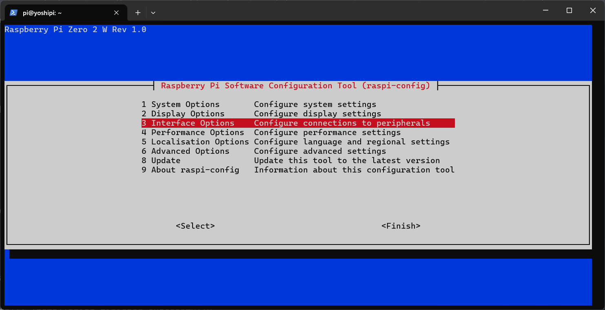
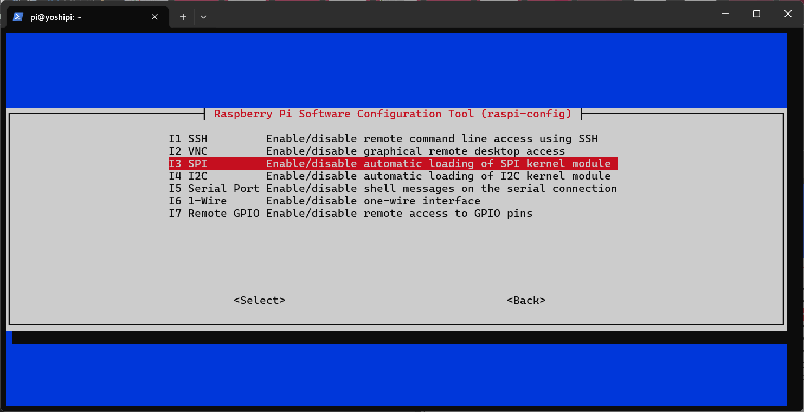
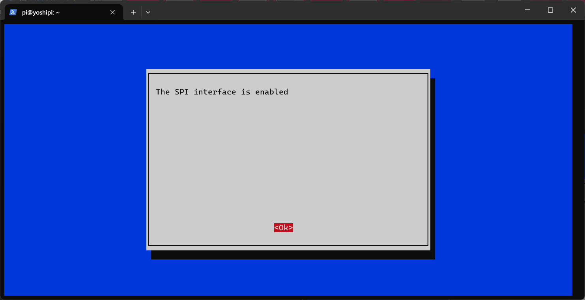
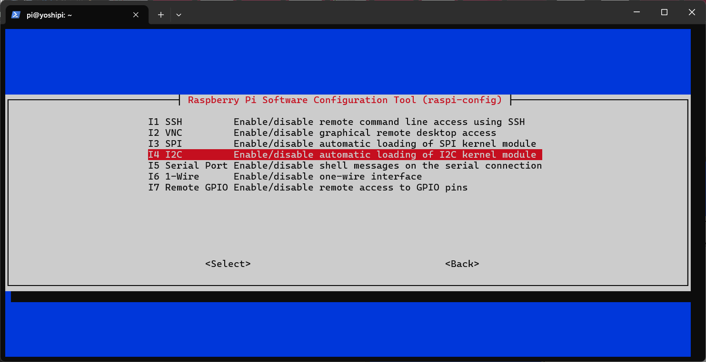
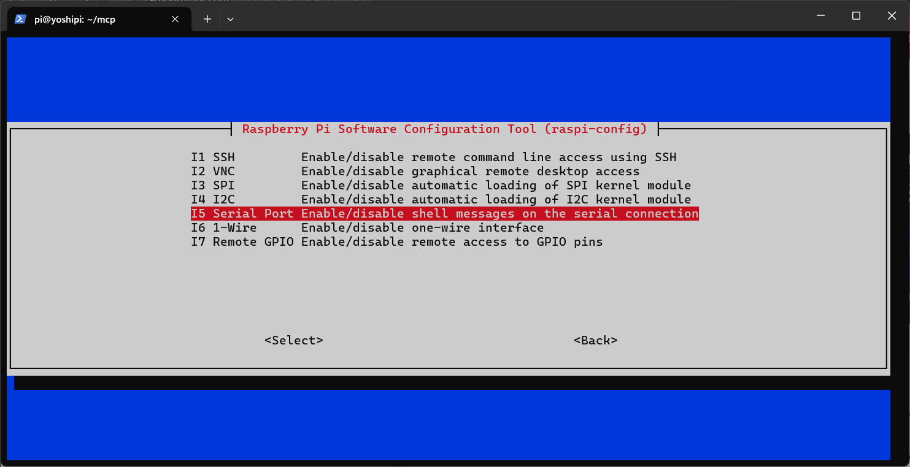
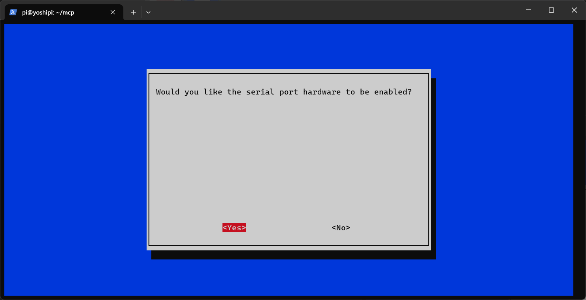
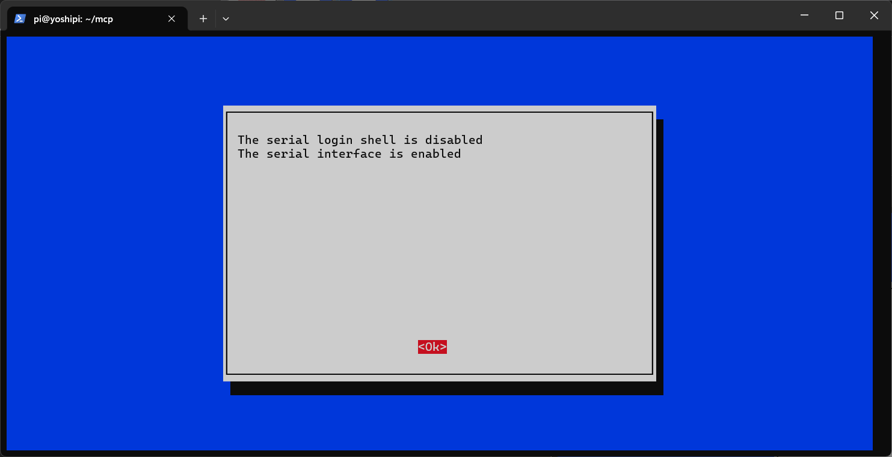

# Installing Prereqs

Before we can start running our applications, we need to install prerequisite libraries and frameworks on the device and enable some things.  We will do this from the SSH session.

## Install .NET

Create and edit a new shell script
```
$ nano raspi-dotnet.sh
```

```
#!/bin/bash

add_to_bashrc() {
    local string="$1"
    if ! grep -q "$string" "$HOME/.bashrc"; then
        echo "$string" >> $HOME/.bashrc
    fi
}

wget --inet4-only https://dot.net/v1/dotnet-install.sh -O - | bash /dev/stdin --version latest
add_to_bashrc "export DOTNET_ROOT=\$HOME/.dotnet"
add_to_bashrc "export PATH=\$PATH:\$HOME/.dotnet"
source ~/.bashrc
```

<ctrl-s><ctrl-x>

List the local files

```
$ ls -l
total 4
-rw-r--r-- 1 pi pi 364 May 28 20:22 raspi-dotnet.sh
```

Make the shell script executable

```
$ chmod +x raspi-dotnet.sh
$ ls -l
total 4
-rwxr-xr-x 1 pi pi 364 May 28 20:22 raspi-dotnet.sh
```

Execute the script

```
 $ ./raspi-dotnet.sh
```

This take a long time, like over 5 minutes long.  Be patient.  In the end you should see something like

```
dotnet-install: Installation finished successfully.
```

Now re-load your environment and verify the install

```
$ source ~/.bashrc
$ dotnet --version
8.0.301
```

## Enable Hardware Things

Now you have to enable access to things like the hardware busses and GPIO

```
$ sudo raspi-config
```

### Enable SPI0






### Enable I2C




### Enable Serial Port






### Enable SPI1

Enabling the second SPI port (`SPI1`) requires directly modifying the device config file.

```
$ sudo nano /boot/firmware/config.txt
```

Navigate to the bottom and add 
```
dtoverlay=spi0-1cs,cs0_pin=44`
dtoverlay=spi1-1cs,cs0_pin=45`
```

### Allow non-sudo` access to Network Manager

If you need to use WiFi from your application, it's much simpler to grant access to the NetworkManager to the `netdev` user group.

```
$ sudo touch /etc/polkit-1/localauthority/90-mandatory.d/99-network.pkla
$ sudo nano /etc/polkit-1/localauthority/90-mandatory.d/99-network.pkla
```

Add the following to the bottom of the file (it will likely be empty)

```
[Allow netdev users to modify all network states and settings]
Identity=unix-group:netdev
Action=org.freedesktop.NetworkManager.*
ResultAny=yes
ResultInactive=yes
ResultActive=yes
```

## Reboot

Many of these changes will not take effect until after a reboot.

```
$ sudo reboot
```